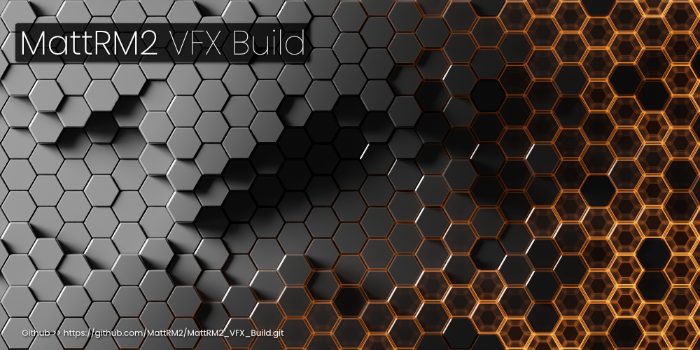
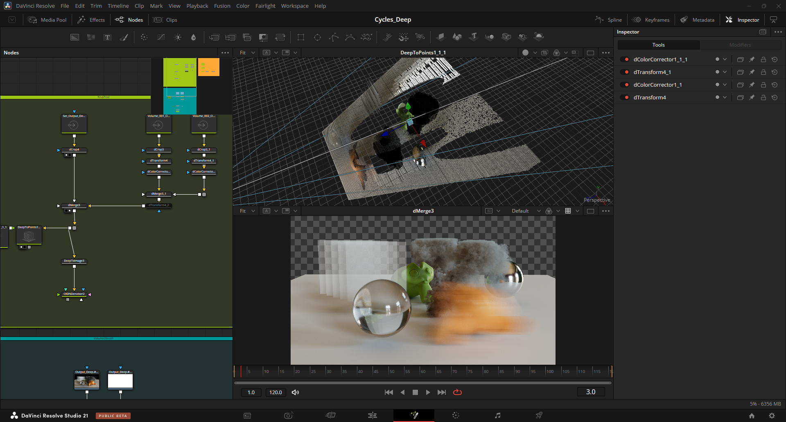
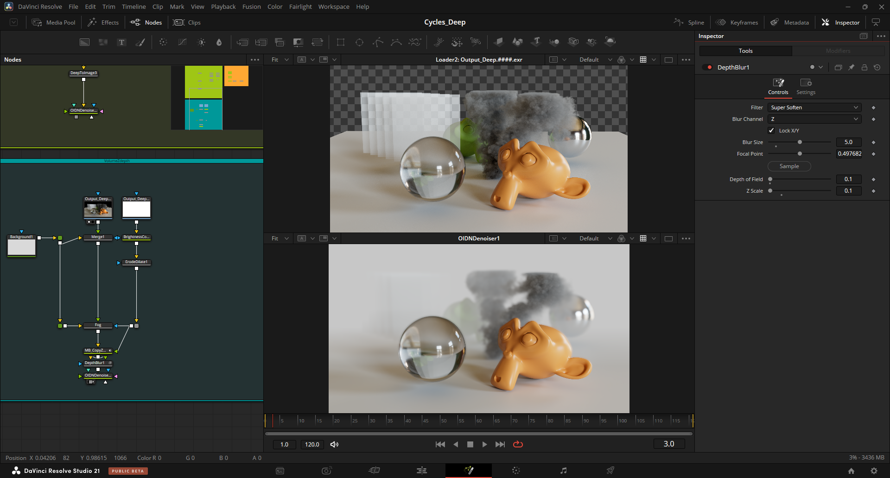
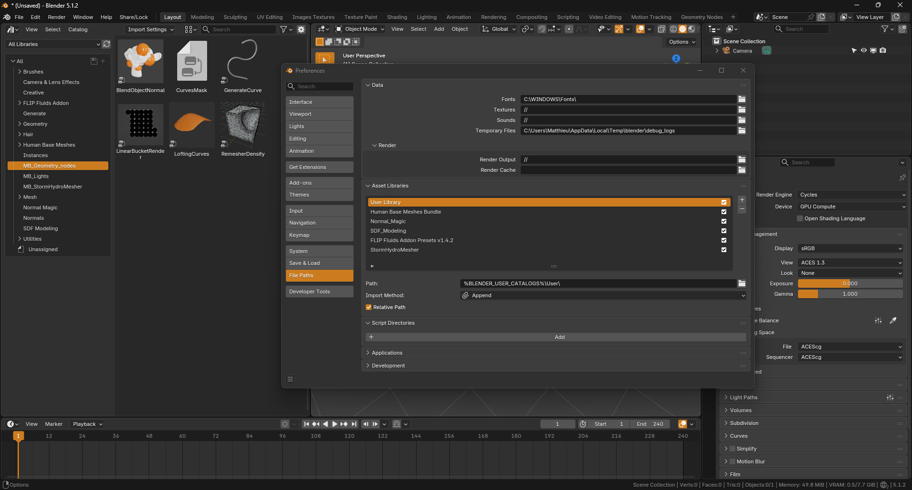
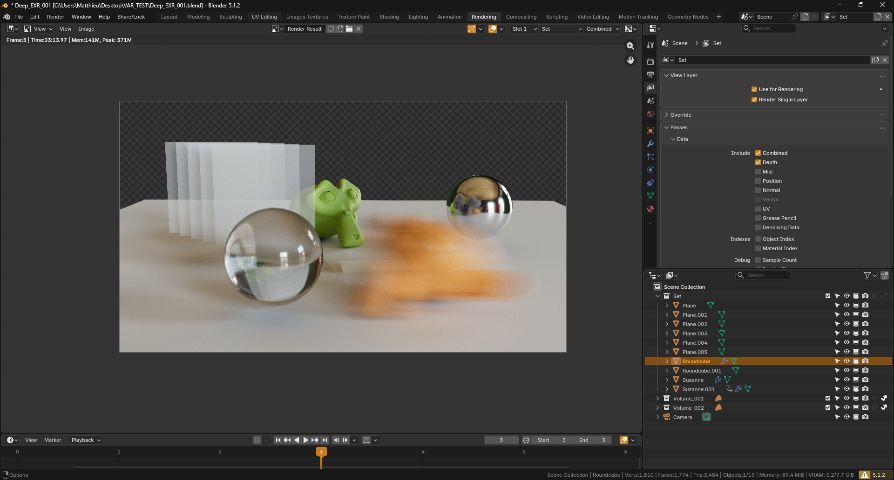

<div align="center">
  
</div>

# MattRM2 VFX Build

A custom Blender build targeting professional VFX pipelines. Built on top of the official Blender 5.1.2 release, this distribution extends Cycles with features that have been standard in high-end renderers (Arnold, RenderMan) for years but are missing from stock Blender.

> **Status — Beta**
> This build is in active testing, professionals and passionate hobbyists alike. Your feedback is welcome and will directly shape what comes next.

> **Unofficial build.** *MattRM2 VFX Build* is an independent, modified version of Blender, licensed under the **GNU GPL v3**. It is **not** created, sponsored, or endorsed by the Blender Foundation. "Blender" is a trademark of the Blender Foundation — [blender.org](https://www.blender.org).

---

## Why This Build

Blender is a world-class tool, but certain VFX pipeline features remain absent or incomplete for production use. This build focuses on three core gaps for now:

- **Deep EXR compositing** — the industry-standard format for high-quality depth compositing (DOF, motion blur, volume integration), not supported in stock Blender Cycles
- **Z-Depth with volumes** — volumes are now present in a new, antialiased Z-Depth pass
- **Pipeline path flexibility** — environment variable support in all file paths, including Preferences
- **And more** — see the roadmap at the end

The goal is not to diverge from Blender, but to ship production-ready features to artists now, and to upstream fixes and improvements to the official project over time.

---

## What's New

### <u>Deep EXR — Cycles CPU</u>

A full Deep EXR implementation for Cycles, following the **Arnold / RenderMan architecture**:

- **Surfaces** — recorded per-sample, Motion Blur and Depth of Field preserved naturally. The deep flatten is pixel-perfect identical to the standard flat EXR render.
- **Volumes** — Arnold-style single-ray raymarch per pixel. Multiple and overlapping volumes on the same render layer are fully supported.
- **Output** — standard OpenEXR deep scanline format, readable by Nuke, Fusion, Resolve, and any OpenEXR-compliant compositor.
- **Per-view-layer output** — each view layer gets its own subfolder and filename prefix automatically.

> **Note — CPU only in this release.** GPU (OptiX/CUDA) port is on the roadmap.
>
> **Volumes require Unbiased mode** (delta-tracking). A warning is shown in the panel if Biased volume is active.

<div align="center">
  
  <p>Cycles Deep EXR in Davinci Resolve - Fusion</p>
</div>

---

### <u>Z Depth Pass — Antialiased, Volume & Transparency Aware</u>

An upgraded Z depth pass: **antialiased, volume-aware and transparency-aware**. No mode selector — just enable **Depth**. It works with or without Deep EXR.

The final `Depth` channel is a **`min(surface, volume)`** combine (*nearest wins*), immune to the over-bright that an alpha-over depth produces under motion blur and depth of field.

- **Antialiased** — coverage-weighted per-sample depth, smooth edges instead of the hard single-sample Z of stock Blender.
- **Volume & transparency aware** — volumes and semi-transparent surfaces contribute correctly; low-opacity volumes (wispy smoke) blend toward the background instead of pulling the depth to the front.
- **Clean background** — empty pixels are filled with the maximum scene depth, so a **Normalize** node maps the whole frame cleanly (no `1e10` spike).

> **Note:** this diverges from stock Blender's Z (non-antialiased, single sample). The output is a true antialiased depth ready for Normalize, defocus, and depth-driven atmospherics.
>
> **CPU only** — the antialiased Z-Depth works with **CPU rendering only**. GPU rendering is not yet supported and will **crash Blender**, so use CPU for this pass. A GPU port is on the roadmap.

<div align="center">
  
  <p>Cycles New Zdepth with volume in Davinci Resolve - Fusion</p>
</div>

---

### <u>Environment Variables in File Paths</u>

File paths anywhere in Blender (render output, textures, libraries, caches) now support environment variable expansion:

```
$MY_PROJECT/renders/####.exr
${SHOT_DIR}/textures/diffuse.png
%PIPELINE_ROOT%/assets/char.blend
```

All three syntaxes are supported cross-platform. Variables are expanded at path resolution time, so `.blend` files remain portable across machines with different local configurations.

<div align="center">
  
  <p>Full %Environment_Variables% support</p>
</div>

---

## Bugfix

### <u>Node Editor Click-Drag</u>
Fixed an official Blender 5.1 bug where click-dragging a node would move a different node than the one under the cursor — the incorrect selection persisted in the `.blend` file. Included ahead of the upstream patch.

### <u>Volume Indirect-Only Shadows</u>
Fixed a Cycles bug where volumes placed in **Indirect-Only** collections would not cast shadows on surrounding surfaces. In particular, when the volume's bounding box intersected the floor or another object, the shadow disappeared on the intersecting surface in this mode (most visible in Unbiased mode).

<div align="center">
  <table>
    <tr>
      <td align="center"></td>
      <td align="center"></td>
    </tr>
    <tr>
      <td align="center"><b>Before</b> — stock Blender 5.1.2: no shadow where the bounding box meets the floor</td>
      <td align="center"><b>After</b> — this build: shadow cast correctly</td>
    </tr>
  </table>
</div>

---

## Known Limitations

| Issue | Workaround |
|---|---|
| Deep EXR is CPU only | GPU port is on the roadmap |
| Deep EXR volumes require Unbiased mode | Use Unbiased (delta-tracking). A warning is shown in the panel if Biased is active. |
| Z Depth is CPU only (GPU rendering crashes Blender) | Use CPU rendering for the Depth pass. GPU port is on the roadmap. |
| Z Depth: hard edge where a motion-blurred surface is partially in front of a volume | Render surface and volume on separate View Layers, each with a Depth pass, and `min()` them in compositing |

---

## Roadmap

### Near Term
- **PySide6 UI Integration (Qt for Python)** — bundle Qt for Python (LGPL) in Blender's interpreter to enable rich custom pipeline tools (asset browsers, farm submitters, advanced panels) beyond the native UI - // WIP //
- **View Layer Attribute Overrides** — per-layer render settings, engine, samples, denoise, material overrides (Maya-style) - // WIP //
- **Multi-layered Deep EXR** — all layers and deep in one file

### Medium Term
- **Deep EXR & Z-Depth GPU** — port the deep volume raymarch, surface recording, and the antialiased volume-aware Z-Depth to OptiX / CUDA (both are currently CPU only)
- **LPE (Light Path Expressions)** — custom AOVs via light path expressions (Arnold / RenderMan parity)
- **DeepID** — extend deep channels with `objectId`, `materialId`, `normal`, `albedo` per fragment
- **Deep + DeepID Compositor Nodes** — native Blender compositing nodes for deep data manipulation (Deep Merge, Hold-Out, ID filter)

### Long Term
- **Plugins for DaVinci Resolve Fusion** — DeepID Sampler, Deep Fog, Deep Relight (Nuke workflow parity in Fusion - 'Deep+ Tools' for Fusion)
- **Caustics** — fast accurate caustics (Photon Map / guided raymarcher)
- **Fix limitation Volume Unbiased** — Add deep working with biased volume
- **R&D for heavy production scenes** — Top Secret right now

---

## Build Information

| | |
|---|---|
| **Base** | Blender 5.1.2 (official release) |
| **Branch** | `blender-v5.1-custom` |
| **Platform** | Windows x64 |
| **Compiler** | MSVC 2022 (vc17) |
| **OptiX** | 8.0.0 |

---

## Feedback

This build is in active development. If you encounter unexpected behavior, crashes, or rendering differences vs. stock Blender, please report with:
- `.blend` file or minimal reproduction scene
- Render settings (samples, volume mode, Deep EXR settings)
- OS and GPU

Your feedback directly influences what gets built next.

---

## About

This build was created by me, **Matthieu Barbié**, a 3D professional with experience on film and series productions. Frustrated by the gap between Blender's excellent foundations and the production-ready features available in commercial renderers like Arnold and RenderMan, I set out to build what was missing, starting with Deep EXR — the format that defines professional depth compositing workflows. Claude Code was also involved for the C/C++ coding, after a month spent in the EXR documentation and reverse-engineering Arnold's and RenderMan's Deep on my side.

This project represents months of low-level Cycles development: deep EXR architecture, Arnold-style volume rendering, pipeline integration, and upstream bug fixes. All improvements are developed with the intent to contribute back to the official Blender project over time.

> *"Blender deserves to be a first-class citizen in VFX pipelines. This build is a step in that direction."*

---

## License

This build is a modified version of Blender, distributed under the **GNU General Public License v3**. Blender is © the Blender Foundation and contributors — see [blender.org/about/license](https://www.blender.org/about/license/).

"Blender" is a trademark of the Blender Foundation. *MattRM2 VFX Build* is an independent project and is **not** affiliated with, sponsored by, or endorsed by the Blender Foundation.
