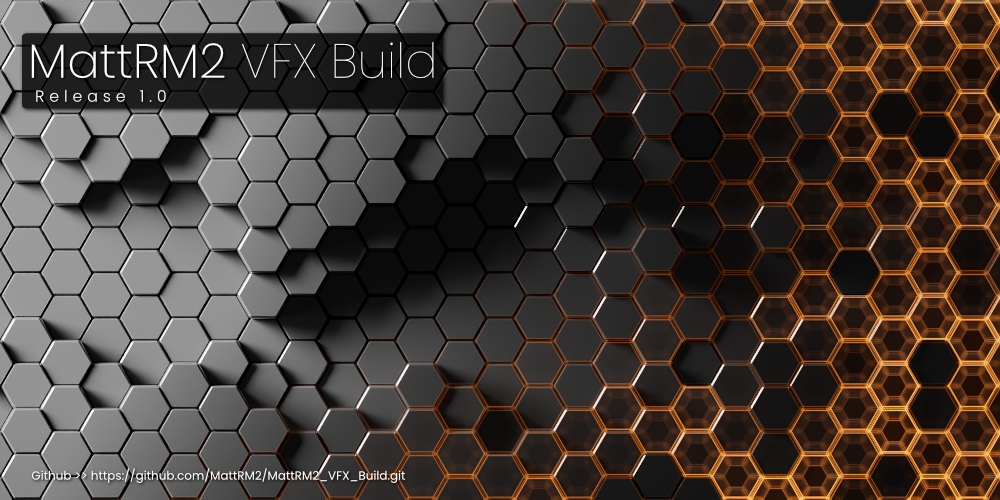
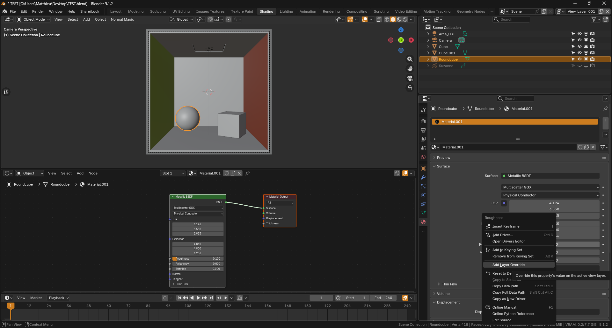
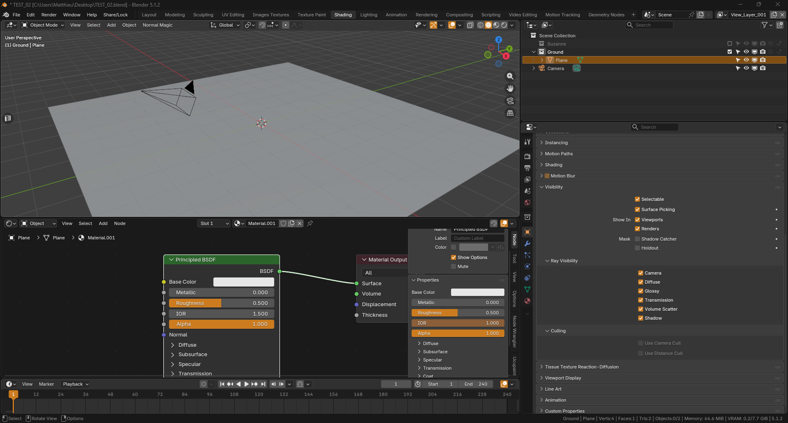
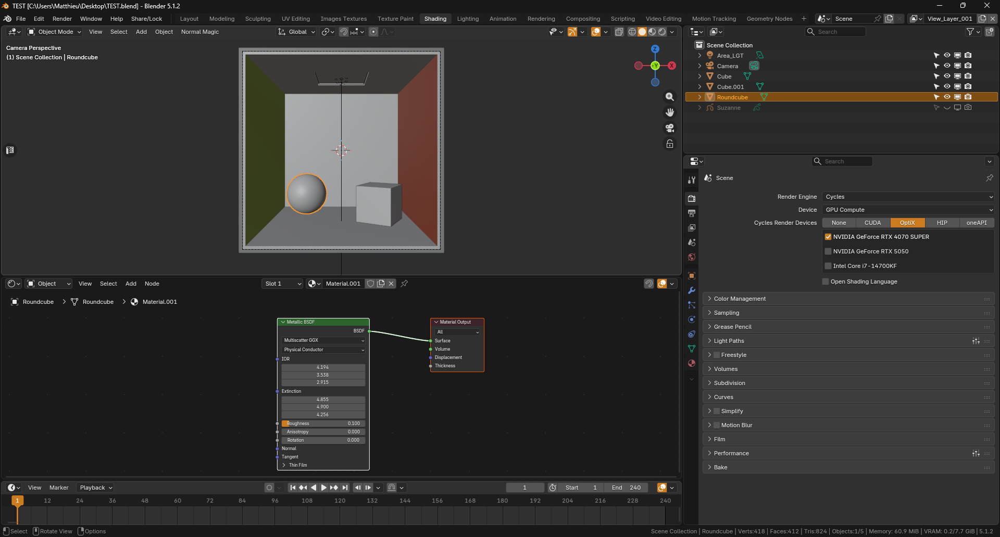
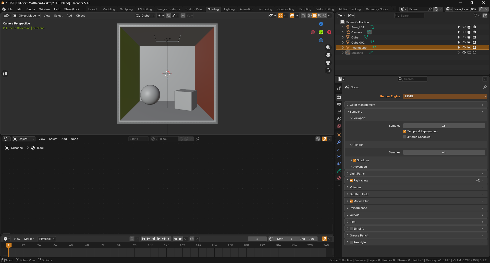
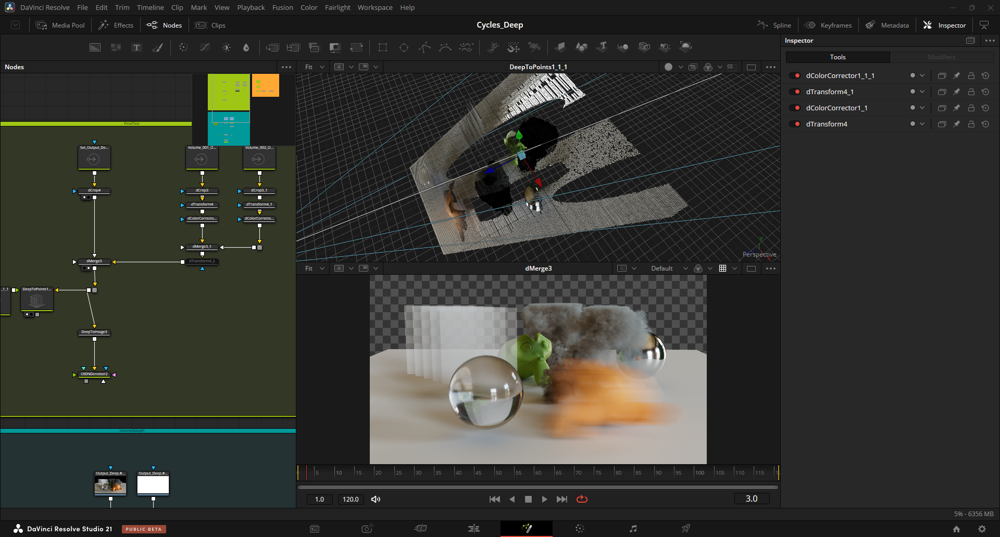
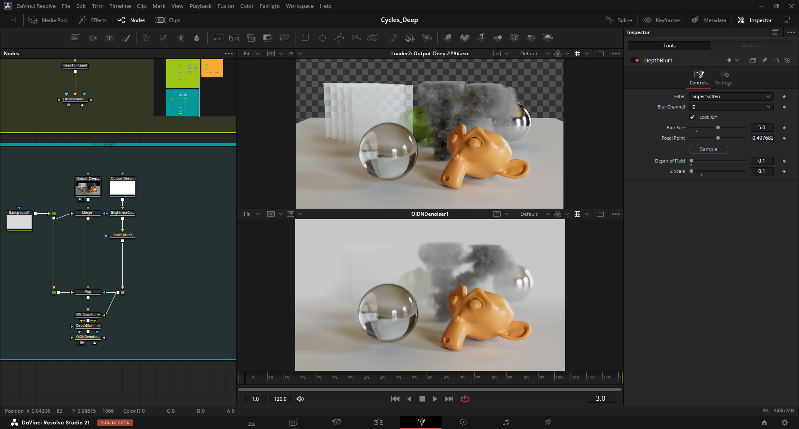
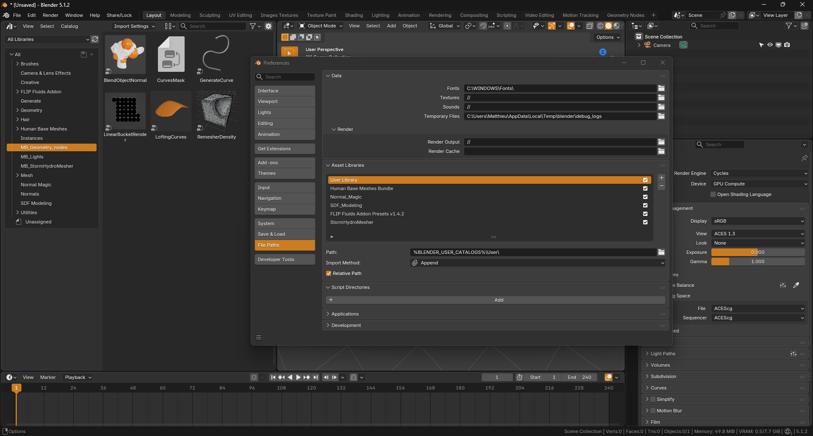
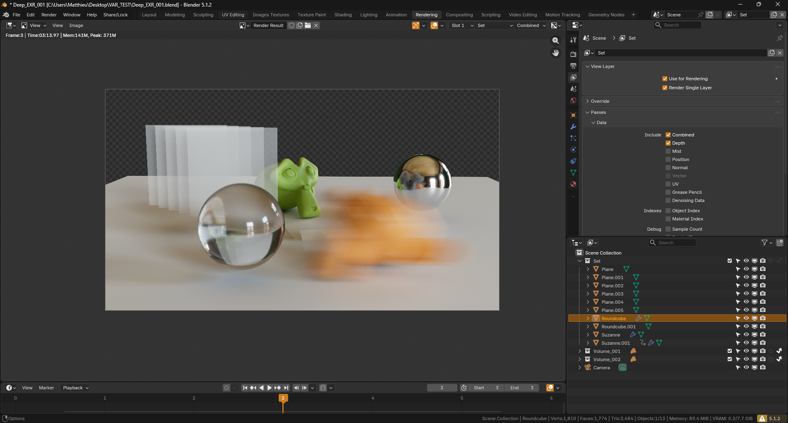

<div align="center">
  
</div>

# MattRM2 VFX Build

A custom Blender build for professional VFX pipelines. Built on Blender 5.2.2 LTS, it extends Cycles with production features long standard in Arnold and RenderMan but missing from stock Blender.

> **Release 1.1** — **the build is renamed.** The executable is now `MattRM2VFX.exe`, with its own name, icons and splash. Everything else is unchanged: same `.blend` format, same Python API, same configuration folder, same add-ons. See [The Rename](#the-rename--and-why-nothing-else-changed) below.
>
> This release also brings the **reworked Z Depth pass** (locked Near/Far, Normalize, volume depth composited against the surface behind it rather than against the range), several **deep volume fixes**, and a fix for a **Cycles regression** that broke rendering when the texture cache was used with CPU and GPU together.

> **Unofficial build.** *MattRM2 VFX Build* is an independent, modified version of Blender under the **GNU GPL v3**. It is **not** created, sponsored, or endorsed by the Blender Foundation. "Blender" is a trademark of the Blender Foundation — [blender.org](https://www.blender.org).

---

## Why This Build

Blender is world-class, but a few VFX pipeline features are still missing for production. This build closes the core gaps:

- **Deep EXR** — industry-standard depth compositing (DOF, motion blur, volumes), on **CPU and GPU**
- **View Layer Overrides** — Maya-style per-render-layer attribute overrides, up to the **render engine per layer**
- **Z-Depth with volumes** — a new antialiased, volume-aware depth pass
- **Environment variables** in every file path, Preferences included
- **Qt Tools (PySide6)** — a separate-process Qt UI framework for pipeline tools
- **And more** — see the roadmap

The goal isn't to fork Blender, but to ship production features now and upstream fixes over time.

---

## The Rename — and Why Nothing Else Changed

Until 1.0.0 this build shipped as `blender.exe`, under Blender's name, icons and logo. That was never right: the Blender name and logo are **trademarks of the Blender Foundation**, and they are explicitly *excluded* from the GNU GPL. The GPL grants the right to modify and redistribute the **code** — it grants nothing over the **brand**. Shipping a modified Blender under Blender's own identity blurs the line between an official release and this one, which is exactly what trademark law exists to prevent.

So 1.1 gives the build its own identity: **`MattRM2VFX.exe`**, its own application and file icons, its own splash and its own name throughout the interface.

### What this changes for you

| | |
|---|---|
| The executable | `blender.exe` → **`MattRM2VFX.exe`** |
| Desktop shortcuts | must be recreated once |
| Pipeline tools, render farms, watch folders | point them at `MattRM2VFX.exe` in their *Blender executable* setting |

If a third-party tool insists on an executable literally named `blender.exe`, create a hard link from the installation folder — `mklink /H blender.exe MattRM2VFX.exe`.

### What this does *not* change — by design

This is a rebrand on the surface. Underneath, the build stays **deliberately identical to Blender**:

- **`.blend` files are unchanged.** Same format, same magic header. Files move in both directions between this build and official Blender, with no conversion and no loss.
- **The Python API is unchanged.** `bpy.app.version` still reports `(5, 2, 2)`. Every add-on that checks the Blender version keeps working, and nothing was added to `bpy` that could shadow it.
- **The configuration folder is shared.** Preferences, add-ons and extensions live where Blender puts them. Your existing setup is picked up as-is — nothing to reinstall.
- **The online extensions platform works normally.** The build identifies itself to `extensions.blender.org` exactly as Blender does, so compatibility filtering behaves correctly.
- **Keymaps and themes are untouched.** *Blender Dark*, *Blender Light* and the stock keymaps are still there under their own names.

The one consequence worth knowing: because the configuration folder is shared, installing this build **alongside** an official Blender 5.2 means both use the same preferences and add-ons. A setting changed in one appears in the other.

> **This is not a fork.** It tracks Blender release by release, and the goal remains to ship production features early and push fixes upstream over time.

---

## What's New

### <u>View Layer Attribute Overrides — Maya-Style Render Layers</u>

Override almost **any property per view layer** — the workflow of Maya's Render Setup, native in Blender. Right-click a property, **Add Layer Override**, and that layer gets its own value; every other layer keeps the base one.

- **Right-click workflow** — *Add / Remove Layer Override* on object, light and camera attributes, shader node sockets, and render settings. Overridden properties show a **bold orange label**, and editing them only changes the active layer.
- **Per-layer render engine** — override `Render Engine` itself: one scene can render some layers with **Cycles and others with EEVEE in the same F12**, into the same multilayer EXR. The viewport and the whole render UI follow the active layer's engine.
- **Per-layer samples** — override *Max Samples* per layer: 4096 on the hero layer, 64 on a matte layer, in one render.
- **Per-layer shaders** — override any node socket (a *Mix Shader* factor becomes a per-layer shader switch), with the **material preview** following the active layer.
- **Fully integrated** — values persist in the `.blend`, the color picker / eyedropper / copy-paste / tooltips all read and write the per-layer value, and panels grey in/out per layer.

<div align="center">
  
  <p>Right-click any property — Add Layer Override</p>
</div>

<div align="center">
  <table>
    <tr>
      <td align="center"></td>
      <td align="center"></td>
    </tr>
    <tr>
      <td align="center"><b>Before</b> — base properties, shared by all layers</td>
      <td align="center"><b>After</b> — per-layer overrides active: bold orange labels, layer-local values</td>
    </tr>
  </table>
</div>

<div align="center">
  <table>
    <tr>
      <td align="center"></td>
      <td align="center"></td>
    </tr>
    <tr>
      <td align="center"><b>View Layer 01</b> — scene engine (Cycles)</td>
      <td align="center"><b>View Layer 02</b> — engine overridden to EEVEE: the whole render UI and the viewport follow</td>
    </tr>
  </table>
</div>

> Pipeline-geometry settings (resolution, borders, frame range, output paths/format) are deliberately **not overridable**: they are locked per scene so the multilayer EXR stays consistent. Use the compositor File Output node for per-layer outputs.

---

### <u>Deep EXR — Cycles (CPU + GPU)</u>

A full Deep EXR implementation for Cycles, following the **Arnold / RenderMan architecture** — now on **CPU, CUDA and OptiX (SVM + OSL)**.

- **Surfaces** — per-sample recording; Motion Blur and Depth of Field preserved. The deep flatten is pixel-identical to the flat EXR.
- **Volumes** — Arnold-style raymarch, with **Depth of Field and Motion Blur** support. Multiple and overlapping volumes on one layer are handled, and the **camera may sit inside a volume** (fly-throughs record correctly).
- **Budget-aware** — the per-pixel volume fragment budget can never truncate a volume: the march spreads its fragments across the whole span instead of dropping the far ones. If a budget is ever exceeded anyway, the **Deep EXR panel raises a red warning** and a render report lands in the status bar.
- **Shadow catcher** — the catcher is recorded in the deep as a **shadow matte** (black RGB, shadow-density alpha), ready to deep-merge over footage — including catchers seen behind or through volumes.
- **Output** — standard OpenEXR deep scanline, read by Nuke, Fusion, Resolve, and any OpenEXR compositor. Single-layer deep files carry the **view layer name** as their part name.
- **Per-view-layer output** — each layer gets its own subfolder and filename prefix.

> **Disable Noise Threshold for deep.** Adaptive sampling (Sampling > Render > *Noise Threshold*) stops pixels at different sample counts, which breaks deep fragment accumulation — the deep output will be wrong. Set Noise Threshold to `0` and render deep with a fixed sample count. Expected, not a bug.

<div align="center">
  
  <p>Cycles Deep EXR in Davinci Resolve - Fusion</p>
</div>

---

### <u>Multi-Layer Deep EXR — All Layers in One File</u>

An **output format** that packs every view layer's deep into a **single multi-part OpenEXR** — one deep part per layer. Select it in **Output > Media Type > Multi-Layer Deep EXR**.

- **One deep part per layer** (RGBA + Z + ZBack), named after the layer. No subfolders.
- **A true deep file** — deep parts only; the beauty is the deep flatten (DeepToImage).
- **Single codec** for the whole file (None / ZIPS / RLE — the deep-valid codecs), set in the Output panel.
- **Per-layer stats** — `cycles.<layer>.samples` / `render_time` written per layer, like a flat multi-layer EXR.
- **Drop-in** — selecting the format enables deep recording.

> **Compositor note.** **Blackmagic Fusion / DaVinci Resolve read every deep part** — all layers from one file, a real convenience there. **Nuke reads only the first deep part** (its DeepRead handles one part per read); for isolated per-layer deep in Nuke, use the standard output, which writes one deep file per layer in `Deep/<layer>/`.

> **Roadmap — DeepID.** Single-file per-layer isolation in Nuke — and per-fragment IDs/AOVs inside the deep — is the upcoming **DeepID** feature.

---

### <u>Z Depth Pass — Antialiased, Volume & Transparency Aware</u>

An upgraded Z depth: **antialiased, volume-aware and transparency-aware**. No mode selector — just enable **Depth**. Works with or without Deep EXR, on **CPU, CUDA and OptiX (SVM + OSL)**.

- **Near / Far / Normalize, per view layer** — under the **Depth** toggle, mirroring the Mist workflow. `Far` is the value written to empty pixels; **Normalize** remaps `[Near, Far]` into 0–1. In raw mode the pass keeps scene units and geometry beyond Far is **not** clamped.
- **Stable across an animation** — because the range is locked by hand rather than derived from the frame, a distant object entering or leaving the shot no longer shifts every semi-transparent pixel. This matters as soon as a depth-driven defocus is in the comp.
- **Antialiased** — coverage-weighted per-sample depth, smooth edges instead of stock Blender's hard single-sample Z.
- **Volume & transparency aware** — a volume is alpha-over composited against the **measured surface behind that pixel**, so wispy smoke reads at a weighted depth. The result does not depend on the Far setting.
- **Marched at the volume's own Step Rate** — the same value the render marches with, so the pass resolves whatever the render resolves. No extra setting.
- **Visible in the viewport** — *Depth* is listed in the viewport Render Pass menu (readable with Normalize enabled).

> **Setting Far.** Far is not just a display range — it is the **declared depth of the background**. Anything seen through to the world reads at Far, so a volume floating beyond Far over empty background is pinned to it. Real geometry, and volumes composited against it, are not clamped in raw mode. Set Far beyond the farthest thing you care about; too large and everything is squeezed into the bottom of the range, reading dark and low-contrast. Default is **100 m**.

<div align="center">
  
  <p>Cycles New Zdepth with volume in Davinci Resolve - Fusion</p>
</div>

---

### <u>OSL GPU Group-Data Budget</u>

OSL shaders use a fixed per-thread *group-data* buffer on GPU, capped at **2048 bytes** in stock Blender — heavy custom graphs can exceed it and fail to load. This build adds an **OSL GPU Group Data** selector in **Render Properties** (shown when *Open Shading Language* is enabled): from **2048** (default) up to **6144** bytes, in 1024-byte steps.

> **Trade-off:** the buffer is reserved per-thread, so a larger budget lowers GPU occupancy and slows *all* OSL shading. GPU only — OSL on CPU is unlimited. Changing it recompiles the OSL kernels. The `CYCLES_OSL_GROUPDATA_ALLOC` environment variable overrides the menu for advanced setups.

---

### <u>Render Devices in the Render Panel</u>

The Cycles **Device** panel (Render Properties) now shows the **render devices directly** when GPU is selected — the backend (CUDA / OptiX / HIP / oneAPI) and the per-device checkboxes, mirrored from Preferences. Switch backend or pick which GPUs to render on without leaving the render settings. As a rule of thumb: **CUDA** for volumes / Deep EXR / XPU (reference path, and it matches OptiX within a few percent on volume-heavy scenes), **OptiX** for heavy geometry, hair/fur, or GPU OSL (OSL on GPU is OptiX-only).

---

### <u>Environment Variables in File Paths</u>

Every file path (render output, textures, libraries, caches) supports environment variable expansion:

```
$MY_PROJECT/renders/####.exr
${SHOT_DIR}/textures/diffuse.png
%PIPELINE_ROOT%/assets/char.blend
```

All three syntaxes, cross-platform, expanded at resolution time — so `.blend` files stay portable across machines.

<div align="center">
  
  <p>Full %Environment_Variables% support</p>
</div>

---

### <u>Qt Tools (PySide6)</u>

A framework to run **rich Qt (PySide6) UIs in their own process**, isolated from Blender — no freezes, always-on-top, live two-way sync with Blender data. The **MattRM2 Qt Bridge** ships and auto-loads; tools are tiny scripts on a shared SDK.

A **Deep EXR control panel** ships as a demo — enable *MattRM2 — Deep EXR Panel (Qt demo)* in **Preferences > Add-ons**, then open it from the **MattRM2 Qt** tab in the N-panel.

> **For developers** — a custom tool is ~25 lines: declare a layout of Blender property paths and the SDK builds the widgets and handles the IPC. See the documentation for the SDK guide.

---

## Bugfix

### <u>Node Editor Click-Drag</u>
Fixed a Blender bug (still present in official 5.2.2) where click-dragging a node moved a different node than the one under the cursor — the wrong selection persisted in the `.blend`. Included ahead of the upstream patch.

### <u>Volume Indirect-Only Shadows</u>
Fixed a Cycles bug where volumes in **Indirect-Only** collections cast no shadows — on surfaces whose geometry meets the volume's bounding box, and on other volumes (volume-on-volume). Correct on **CPU, CUDA and OptiX**.

<div align="center">
  <table>
    <tr>
      <td align="center"></td>
      <td align="center"></td>
    </tr>
    <tr>
      <td align="center"><b>Before</b> — stock Blender 5.2.2: no shadow where the bounding box meets the floor</td>
      <td align="center"><b>After</b> — this build: shadow cast correctly</td>
    </tr>
  </table>
</div>

### <u>Texture Cache with CPU + GPU Rendering</u>
Fixed a Cycles regression where enabling the **Texture Cache** while rendering on CPU *and* GPU together produced large black regions and corrupted textures. Rendering was correct on a single GPU, on two GPUs, or on CPU alone — only the mix failed.

The multi-device wrapper reported unified image memory as soon as *any* device had it, and the CPU always does. Cycles concluded there was nothing to upload, so the GPUs rendered their share of the frame without ever receiving the texture tiles. Upstream fix, merged for 5.3 and tagged for backport to 5.2 but absent from 5.2.2 — applied here ahead of the official patch.

### <u>Blend File Icon on Windows</u>
Fixed the file association writing its icon reference as a positional index rather than a resource ID, which made Explorer show the **application** icon on `.blend` files instead of the document icon. The same defect exists in official Blender, where it goes unnoticed because both icons carry the same mark.

---

## Known Limitations

| Issue | Workaround |
|---|---|
| Deep EXR is incompatible with **Noise Threshold** (adaptive sampling) | Adaptive sampling stops pixels at different sample counts, breaking deep accumulation. Set Noise Threshold to `0` and use a fixed sample count. Expected, not a bug. |
| GPU deep uses a per-pixel layer cap (CPU is unlimited) | **Max Depth** `-1` (default) maps to 96 on GPU, and can be raised to 1024. The march never truncates: past the budget it coarsens instead, so the volume stays complete with thicker slabs. Raise Max Depth when a shot needs finer depth resolution. |
| CPU and GPU deep are not bit-identical | The CPU recorder is unbounded; on GPU the march coarsens to fit the per-pixel budget. Same opacities, thicker slabs. Render on CPU if a shot needs the finest possible slabs. |
| Deep looks different in lightweight EXR viewers | Validate deep output in **DaVinci Resolve / Fusion or Nuke**. Some viewers show a discrepancy on deep files that a real deep compositor does not. |
| Per-pixel alpha in the deep differs slightly from the beauty (about ±0.05, averaging out) | Expected: the deep's alpha comes from a deterministic march, the beauty converges stochastically. Raise **Max Depth** for a finer march if a shot needs it. |
| A volume straddling an opaque surface still contributes from its hidden part | The march does not clip at surfaces. In practice self-limiting — dense volumes saturate before the occluder — and always bounded by the nearest surface depth. |
| Multi-Layer Deep EXR: Nuke reads only the first deep part | It's a Fusion / Resolve format; for Nuke, use the standard per-layer deep files (`Deep/<layer>/`). |
| Multi-Layer Deep EXR with multi-view (stereo) | Cycles deep is mono — render mono, or use the per-layer deep files. |
| View Layer Overrides: resolution, borders, frame range and output path/format cannot be overridden | By design — these are read once per render by the pipeline. Use the compositor File Output node for per-layer outputs — full control over per-layer paths and formats. |
| View Layer Overrides: animated or driven properties cannot be overridden | By design — an override and an F-Curve would fight over the value. Remove the animation first, or drive the property per layer another way. |
| Z Depth: hard edge where a motion-blurred surface is partly in front of a volume | Split only the **Depth**: render surface and volume on separate View Layers, each with Depth, and `min()` the two depths in compositing. The color / beauty pass can keep both surface and volume together. |
| Multi-device (XPU) + OptiX: a camera-visible Indirect-Only volume over a Shadow Catcher can leave a faint CPU/GPU seam in the Shadow Catcher pass | Render such shots on **CUDA** (fully consistent), or set the volume camera-invisible. Does not affect CUDA XPU, pure OptiX, or any other pass. |

---

## Roadmap

Planned by version — order and scope may shift as development progresses.

| Version | Planned |
|---|---|
| **v1.2** | **Deep compositing node** (native Blender deep node) + **deep output support in the Compositing EXR writer** |
| **v1.3** | **DeepID** — per-fragment `objectId`, `materialId`, `normal`, `albedo` — plus a **DeepID compositing node** |
| **v1.4** | **LPE (Light Path Expressions)** — custom AOVs (Arnold / RenderMan parity) |
| **v1.5** | **Advanced caustics** — a fast, accurate caustics engine, tracing through volumes |
| **v1.6** | **USD stage** — Universal Scene Description stage support |
| **v1.7** | **Scene management** — Gaffer HQ / Katana-style manager for the USD stage, Alembic and Blender data (in design) |

---

## Build Information

| | |
|---|---|
| **Base** | Blender 5.2.2 LTS (official release) |
| **Branch** | `blender-v5.2-custom` |
| **Platform** | Windows x64 |
| **Compiler** | MSVC 2022 (vc17) |
| **GPU** | CUDA 12.8 · OptiX 9.1 |

---

## Feedback

Actively developed. If you hit unexpected behavior, crashes, or rendering differences vs. stock Blender, please report with:
- a `.blend` or minimal reproduction scene
- render settings (samples, volume mode, Deep EXR settings)
- OS and GPU

Your feedback directly influences what gets built next.

---

## About

This build was created by me, **Matthieu Barbié**, a 3D professional with experience on film and series productions. Frustrated by the gap between Blender's excellent foundations and the production-ready features available in commercial renderers like Arnold and RenderMan, I set out to build what was missing, starting with Deep EXR — the format that defines professional depth compositing workflows. Claude Code was also involved for the C/C++ coding, after a month spent in the EXR documentation and reverse-engineering Arnold's and RenderMan's Deep on my side.

This project represents months of low-level Cycles development: deep EXR architecture, Arnold-style volume rendering, pipeline integration, and upstream bug fixes. All improvements are developed with the intent to contribute back to the official Blender project over time.

> *"Blender deserves to be a first-class citizen in VFX pipelines. This build is a step in that direction."*

---

## License

This build is a modified version of Blender, distributed under the **GNU General Public License v3**. Blender is © the Blender Foundation and contributors — see [blender.org/about/license](https://www.blender.org/about/license/).

This build also bundles **Qt for Python (PySide6)** and **Qt**, used under the **GNU LGPL v3** (Qt libraries are dynamically linked). Qt is © The Qt Company and contributors — see [qt.io](https://www.qt.io). The full license texts are included in the distribution's `licenses/` folder.

"Blender" is a trademark of the Blender Foundation. *MattRM2 VFX Build* is an independent project and is **not** affiliated with, sponsored by, or endorsed by the Blender Foundation.
